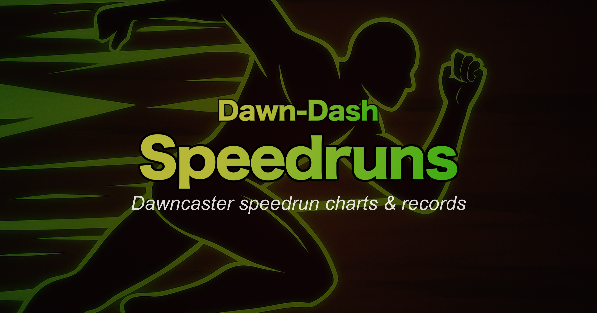
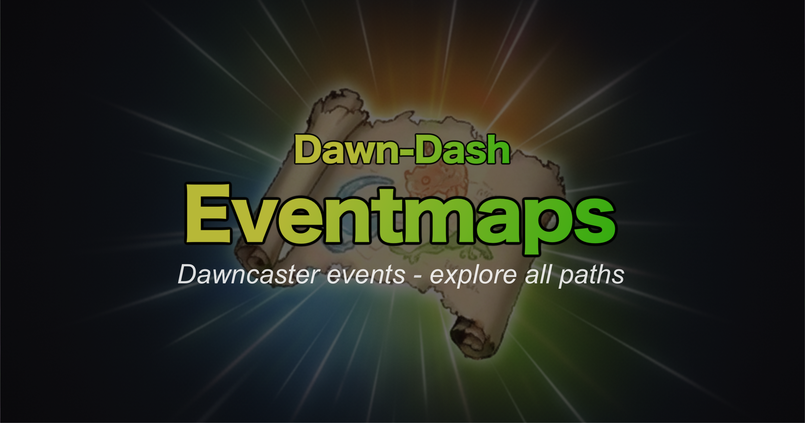

# 🏃‍♂️ Dawn-Dash 💨

>An open-source collection of useful **tools and resources** for the mobile RPG: [Dawncaster](https://dawncaster.wanderlost.games/).

**Check it out:** [dawn-dash.com](https://dawn-dash.com/)

## 🏃 Speedruns
Visualization and tracking of all speedrun attempts, for all game modes!

- 📉 Charts of record-breaking runs and player progressions, for all modes and difficulties of the game.
- 🔍 Various filters and sorting options to focus on the runs you want to see.
- 🔗 And if you submitted your run via the official [Dawncaster Discord](https://discord.gg/pfeMG9c), your **Discord name** will be linked to your run!

**Check it out**: [Speedruns](https://dawn-dash.com/speedruns)

----------

## 🎴 The Cardex

A **Cards Codex** tool, supporting multi-keyword-search, advanced filtering, card-tracking and more!

Mainly tailored towards the **Weekly Challenges**, this tool lets you:
 - 🔍 Look up several cards at once based on given keywords.
 - 🧮 Filter based on card sets, banners, rarities, and more.
 - 🏹 And track the cards as you progress through your run collecting them!

**Check it out**: [Cardex](https://dawn-dash.com/cardex)

----------

## 🕺 The Skilldex

A **Talents Codex** tool, for visualizing all the in-game talents as tiny talent trees, with several search, filtering and formatting options!

Tailored towards anyone trying to plan out a specific run, or just looking for new fun talents to unlock, this tool lets you:
 - 🔍 Look up several talents at once based on given keywords.
 - 🌳 Visualize the talents in tiny trees, based on their prerequisites or later talents.
 - 🧮 Filter based on card sets, requirements, tiers, and more.

**Check it out**: [Skilldex](https://dawn-dash.com/skilldex)

----------

## 🗺️ The Eventmaps

An **Events Codex** tool (work in progress), featuring fully mapped out event trees with all dialogue options, requirements, and rewards!

**Check it out**: [Eventmaps](https://dawn-dash.com/eventmaps) (WIP)

----------

If you have any thoughts, questions, ideas, or feedback, you can either:

- 💬 Reach out to me in the [Dawncaster Discord](https://discord.gg/pfeMG9c) (I'm joel6801)
- 📝 Open an issue here to discuss your ideas or report bugs

----------

## 🤝 Contribution

This project is open source, and any contributions are **greatly** appreciated.

Please read the [📖 Contributions guide](./CONTRIBUTING.md) if you want to add some cool features!

----------

## 🙏 Acknowledgments

- [Dawncaster](https://dawncaster.wanderlost.games/) - The awesome game this tool is built for.
- [Wanderlost Games](https://wanderlost.games/) - Game developers.
- [Blightbane](https://blightbane.io/) - Official resource site for Dawncaster.
